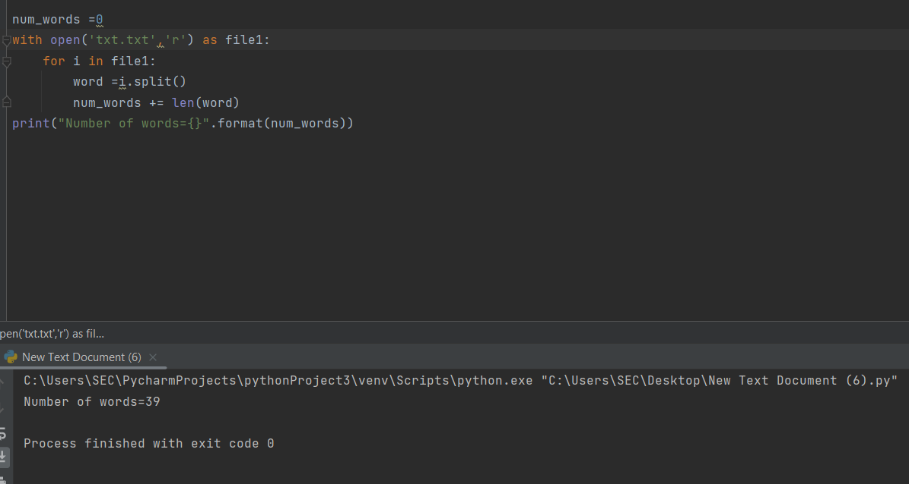
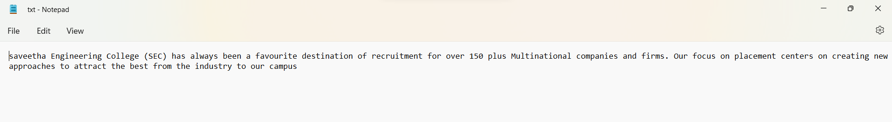

# Word-count
## AIM:
To write a python program for getting the word count from a text.
## EQUIPEMENT'S REQUIRED: 
PC
Anaconda - Python 3.7
## ALGORITHM: 
### Step 1:

Declare a variable count equal to 0.
### Step 2: 
Open the required text file in read mode as text.(any name can be used).
### Step 3: 
Loop until variable i in file text.

### Step 4:  
Declare variable word = i.split().
### Step 5: 

Print the value of count, which has the number of words in the file
### Step 6: 
End of the program
## PROGRAM:
```
#Developed By:praveen s
#Register number:-22009017
num_words =0
with open('txt.txt','r') as file1:
    for i in file1:
        word =i.split()
        num_words += len(word)
print("Number of words={}".format(num_words))
```

### OUTPUT:




## RESULT:
Thus the program is written to find the word count from a text.
